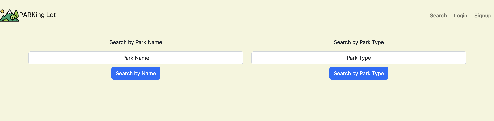

# PARKing Lot

PARKing Lot is an app designed to display information related to all parks operated by the National Parks Service.

To view the app online, visit 

---

## TECHNOLOGIES USED

* Node.js
* Express
* EJS
* JavaScript
* Bootstrap
* Postgres
* Sequelize

---

## HOW TO USE

* Search for parks by their name or park designation (national park, memorial site, national monument, etc...).
* If you would like to save a park for future use, create an account then hit the "Add to Favorites" button found on the respective park page.

---
## HOW TO INSTALL

Requires `Node.js`, `Postgres`, and `Sequelize`

1. Get a free api key from the [National Parks](https://www.nps.gov/subjects/developer/get-started.htm) website.
2. Creat a free [Mapbox](https://account.mapbox.com/auth/signup/) account and take note of the API access token. (Default public token OK)
    * Please note that while you will be required to enter a valid credit card number, your account will not be charged until the api calls pass a limit. For more information, visit https://www.mapbox.com/pricing
3. Fork and clone this repository to your local machine.
4. Create a .env file and add the following:
```env
SECRET_SESSION = [insert any string here]
NP_API_KEY = [insert national parks api key here]
MAP_API_KEY = [insert mapbox api key here]
```
5. Run `npm install` to install dependencies.
5. Run `sequelize db:create`, `sequelize db:migrate:all`, and `sequelize db:seed:all` to setup database.
6. Run `npm run dev` to start server.
7. Open `http://localhost:3000` in a web browser to access app.

---

## SCREENSHOTS

### Search Page


### Park Page


---

## HOW IT WORKS
PARKing Lot uses the National Parks api to get information on every park and the Mapbox api to display a park's location on it's respective page.

Users can add/remove parks to a favorites database for quick access to liked parks.

### API CALLS
Although the database has been seeded with information on all parks, there's still more data to use! Below is the code written to access data on Zion National Park. Each park has a unique parkCode that can be used to retrieve information. This code is a 4 letter string and has been seeded for every park. 

```javascript
axios.get(`https://developer.nps.gov/api/v1/parks?limit=500&parkCode=zion&api_key=${apiKey}`)
      .then(response => {
        const park = response.data.data[0]; // returns an object with all information related to Zion National Park
      })
      .catch(error => {
        console.log('error', error);
        let message = 'Cannot find park. Please try again...';
        res.render('error', { message });
      });
    // console.log('req.params.name', req.params.parkCode);
```
Afterwards, we can grab the information we've chosen to display on our park page (name, url, images, activities, hours) and the longitude/latitude data to insert into the Mapbox api.

```javascript
router.get('/:parkCode', (req, res) => {
    axios.get(`https://developer.nps.gov/api/v1/parks?limit=500&parkCode=${req.params.parkCode}&api_key=${apiKey}`)
      .then(response => {
        const park = response.data.data[0];
        const mapUrl = `https://api.mapbox.com/styles/v1/jondav/clidupmg9001q01r74k0r36np.html?title=false&access_token=${mapApiKey}&zoomwheel=false#7/${park.latitude}/${park.longitude}`
        res.render('park', { park, mapUrl });
      })
      .catch(error => {
        console.log('error', error);
        let message = 'Cannot find park. Please try again...';
        res.render('error', { message });
      });
    // console.log('req.params.name', req.params.parkCode);
  })
```
---

## A LOOK TO THE FUTURE
These are some features I would like to implement.

### NOTES
I'd like to give users the option to write notes and/or rate parks that they've visited.

### DISPLAY MORE INFORMATION
I'd like to show the user more information on each park (such as prices, directions, topics). I'm thinking these can be additional routes such as /zion/prices.

### MORE SEARCHES
I'd like to add more search conditions such as by state, activity, price and eventually have the different search requests work together to be as specific as the user would like (barring the park name)

### NOTIFICATIONS
Show some kind of confirmation for actions.

---

## ATTRIBUTIONS
* [National Parks Service](https://www.nps.gov/subjects/developer/index.htm)
* [Mapbox](https://www.mapbox.com/)